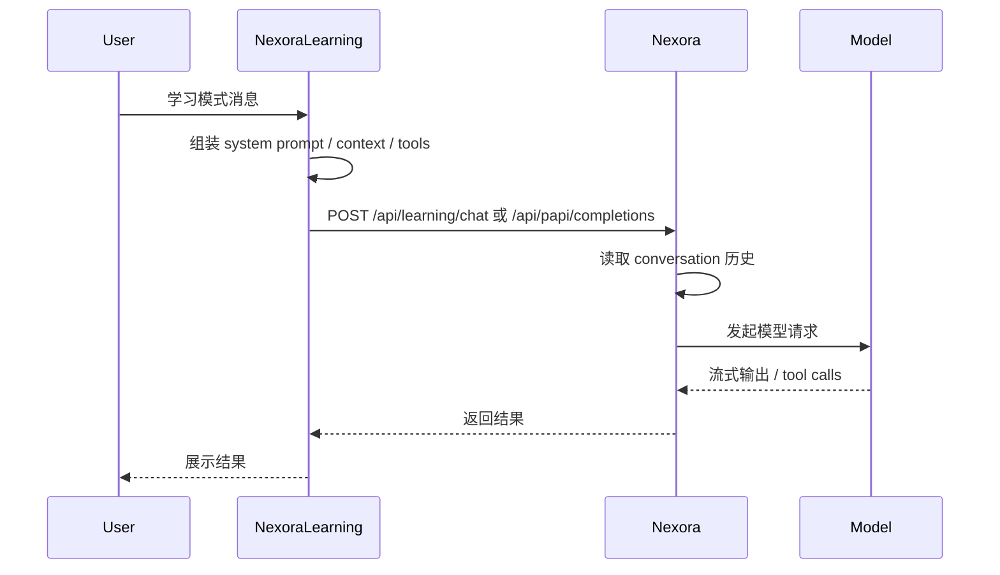

# NexoraLearning Dialog API

本文档定义当前推荐的学习对话接入方式：

- `NexoraLearning` 作为上层学习对话编排器
- `Nexora` 作为下层对话记录与模型执行内核

也就是：

- `NexoraLearning -> Nexora`

而不是反过来以 `Nexora -> NexoraLearning` 为主。

---

## 一、核心设计

### NexoraLearning 负责

- 决定当前轮学习模式 system prompt
- 决定当前轮学习上下文注入
- 决定当前轮学习工具列表
- 决定当前轮模型参数
- 发起本轮学习对话请求

### Nexora 负责

- conversation / messages 持久化
- 历史记录读取与裁剪
- 模型请求真正执行
- 流式输出
- tool call 主循环

---

## 二、最终职责边界

推荐边界如下：

- `NexoraLearning` 不管理聊天历史主存储
- `NexoraLearning` 可以完全覆盖学习模式下的 system prompt
- `Nexora` 继续管理历史消息与上下文窗口

一句话：

`NexoraLearning 管本轮对话策略，Nexora 管历史与执行。`

---

## 三、推荐主流程



---

## 四、当前推荐主链

不再推荐：

- `NexoraLearning -> /api/learning/dialog/chat -> Nexora`

因为这只是额外增加一层纯转发，没有必要。

当前推荐主链是：

- 上层（Learning 前端 / Learning 编排器）直接调用 `Nexora`
- 直接请求：
  - `POST /api/papi/learning/chat`
  - 或 `POST /api/learning/chat`

也就是：

- `NexoraLearning` 负责组装本轮学习模式请求
- `Nexora` 直接负责会话历史与执行

### 推荐请求示例

```json
{
  "username": "mujica",
  "conversation_id": "conv_xxx",
  "lecture_id": "l_xxx",
  "book_id": "b_xxx",
  "chapter_range": "12000:8000",
  "model": "qwen3.6:27b",
  "messages": [
    {
      "role": "user",
      "content": "帮我解释这一章的重点"
    }
  ],
  "system_prompt": "完整学习模式系统提示词",
  "context_blocks": {
    "course_progress": "...",
    "coarse_summary": "...",
    "intensive_detail": "..."
  },
  "tools": [],
  "tool_choice": "auto",
  "stream": true,
  "think": false,
  "temperature": 0.2,
  "metadata": {
    "source": "nexoralearning"
  }
}
```

---

## 五、推荐的 Nexora 专用学习接口

当前已经在 `Nexora` 侧落了第一版雏形接口：

- `POST /api/papi/learning/chat`
- `POST /api/learning/chat`

推荐长期主入口保留为：

- `POST /api/learning/chat`

语义：

- 这是一个“受外部编排”的学习对话接口
- 历史仍由 Nexora conversation 系统管理
- 但本轮 system prompt / tools / extra_context 由外部传入

### 推荐请求结构

```json
{
  "conversation_id": "conv_xxx",
  "username": "mujica",
  "model": "qwen3.6:27b",
  "messages": [
    {
      "role": "user",
      "content": "帮我解释这一章"
    }
  ],
  "system_prompt": "由 NexoraLearning 生成的完整学习系统提示词",
  "context_blocks": {
    "lecture_id": "l_xxx",
    "book_id": "b_xxx",
    "chapter_range": "12000:8000",
    "coarse_summary": "...",
    "intensive_detail": "...",
    "questions": "..."
  },
  "tools": [],
  "tool_choice": "auto",
  "stream": true,
  "think": false,
  "metadata": {
    "source": "nexoralearning"
  }
}
```

### 当前雏形行为

Nexora 收到后：

1. 用 `conversation_id + username` 读取历史消息
2. 若会话不存在则自动创建
3. 将 `system_prompt + context_blocks` 合并为本轮 system message
4. 将历史消息与本轮 messages 拼接后复用 PAPI 主执行链
5. 先持久化本轮 user 消息
6. 非流式模式下持久化 assistant 文本结果
7. 将结果返回给 NexoraLearning

当前限制：

- 仍然复用现有 PAPI 主链，不是完全独立的新执行栈
- 流式模式当前先透传，不做完整 assistant 落库收尾

---

## 六、短期兼容方案：复用 PAPI

在 `Nexora` 专用学习接口还没实现前，可先复用 PAPI。

推荐扩展字段：

```json
{
  "model": "qwen3.6:27b",
  "messages": [...],
  "stream": true,
  "tools": [],
  "tool_choice": "auto",
  "think": false,
  "temperature": 0.2,
  "system_override": "完整学习模式 system prompt",
  "extra_context": {
    "lecture_id": "l_xxx",
    "book_id": "b_xxx",
    "chapter_range": "12000:8000"
  },
  "metadata": {
    "source": "nexoralearning",
    "conversation_id": "conv_xxx",
    "username": "mujica"
  }
}
```

### 字段语义

#### `system_override`

- 本轮 system prompt 直接由 `NexoraLearning` 提供
- `Nexora` 默认聊天系统提示词不再叠加

#### `extra_context`

- 学习模式附加上下文
- 可用于日志、调试、后续更深层 prompt 组装

#### `metadata`

- 请求链路追踪
- 来源识别
- 对话绑定信息

---

## 七、Learning Tools 建议

虽然当前主控方向是 `NexoraLearning -> Nexora`，但学习工具依然建议由 `NexoraLearning` 提供：

- `learning_list_courses`
- `learning_join_course`
- `learning_leave_course`
- `learning_get_course_progress`
- `learning_get_book_outline`
- `learning_get_book_detail`
- `learning_get_questions`
- `learning_start_coarse`
- `learning_start_intensive`
- `learning_start_question`
- `learning_get_job_status`

这些工具可以：

1. 直接由 `NexoraLearning` 暴露 API
2. 由 `NexoraLearning` 在请求中带上 tool schema
3. `Nexora` 作为模型执行器运行 tool loop

---

## 八、为什么推荐这种反向主控

这比 “Nexora 主动去问 NexoraLearning” 更适合学习产品态，因为：

1. 学习模式 system prompt 更统一
2. 学习注入逻辑集中在 NexoraLearning
3. 学习工具定义集中在 NexoraLearning
4. Learning 前端与后端能保持一致的学习策略
5. Nexora 只做自己最擅长的事情：
   - 会话历史
   - 模型执行
   - 工具循环

---

## 九、最小可落地顺序

### 第一阶段

已完成雏形：

- `NexoraLearning`
  - `POST /api/learning/dialog/chat`

### 第二阶段

建议新增：

- `Nexora`
  - `POST /api/learning/chat`

### 第三阶段

让 `NexoraLearning` 改为优先请求：

- `/api/learning/chat`

而不是普通：

- `/api/papi/completions`

### 第四阶段

补上：

- conversation_id 真实持久化
- assistant/tool 消息落库
- tool loop 绑定学习工具

---

## 十、最终结论

推荐方案是：

- `NexoraLearning` 主控学习对话
- `Nexora` 管理对话历史与模型执行

更准确地说：

- `NexoraLearning` 决定这轮怎么聊
- `Nexora` 决定这轮历史怎么接、模型怎么跑、消息怎么存

这就是当前最适合的集成方向。
