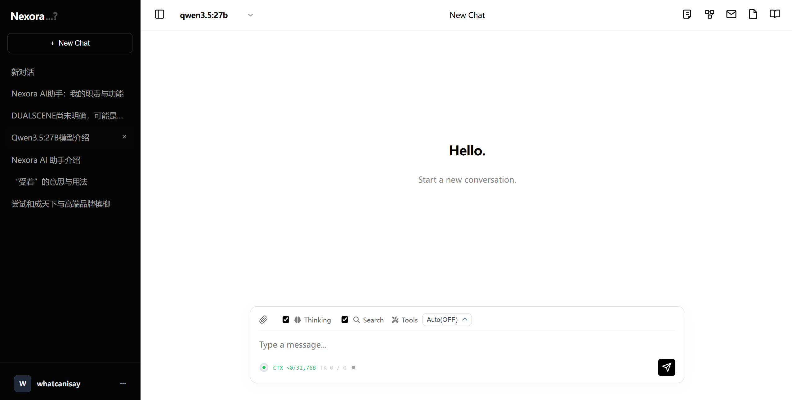

# Nexora

Nexora is a self-hosted AI chat platform with knowledge graph visualization and conversation memory.
  
## 

Introduction Website:
https://chat.himpqblog.cn

## Features

- Decouplable email, RAG, and cloud storage components
- Support for multiple providers including Volcengine, DashScope, OpenAI, and more
- Knowledge base management with vector databases and file storage
- Conversation memory and context management
- Multiple user support with role-based access control
- Multiple function call tools for enhanced capabilities

## Installation
```bash
git clone https://github.com/Himpq/Nexora.git
cd Nexora

pip install -r requirements.txt

cd ChatDBServer
python main.py
```


## Notice
- You need to configure user accounts in `ChatDBServer/data/user.json`
- This project **does not provide LLM models**, you need to setup with ollama or cloud providers.
